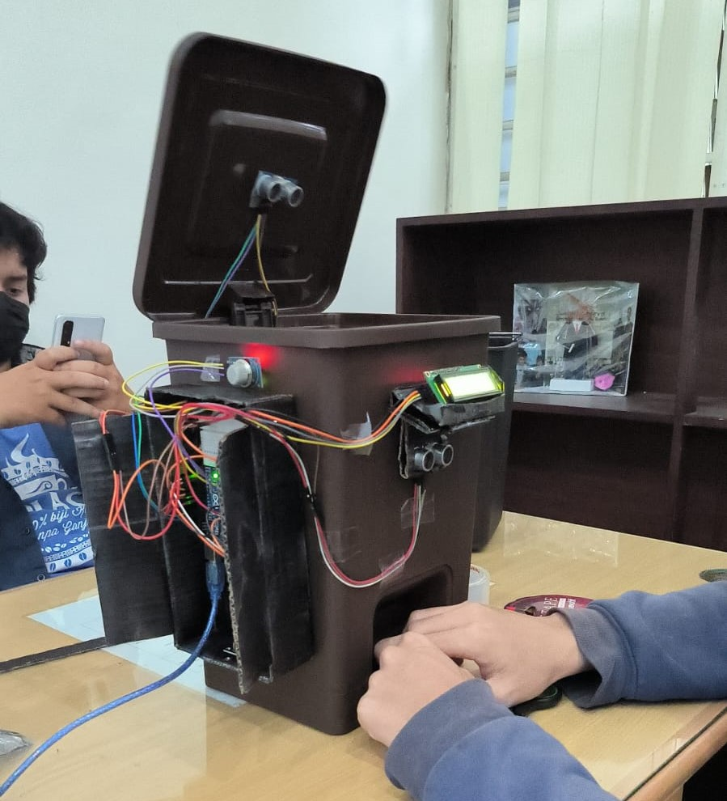

# Smart Dustbin

## Overview
This repository contains the source code and documentation for the **Smart Dustbin** project, developed as part of the Microcontroller Systems last project. The project demonstrates the functionality of a smart dustbin that integrates various sensors and components to optimize waste disposal.

|  |  |
|:----------------------------------------------------------------------:|:-----------------------------------------------------------------------------------:|
| **Smart Dustbin Photo**                                                | **Smart Dustbin Video**                                                            |

## Features
- 🚪 **Automatic lid opening** using ultrasonic detection.
- 🌫️ **Gas leakage detection** with the MQ2 sensor.
- 📟 **LCD display** for real-time feedback.
- 🌐 **IoT connectivity** for remote monitoring.

## Components Used
The following components were utilized in the Smart Dustbin project:

1. 🤖 **Arduino UNO R3** - Microcontroller for primary control.
2. 📡 **NodeMCU V3** - IoT module for wireless connectivity.
3. ⚙️ **Servo MG966R** - Servo motor for lid operation.
4. 📏 **Ultrasonic Sensor** - Detects proximity to trigger lid opening.
5. 🔥 **MQ2 Sensor** - Monitors gas levels for safety.
6. 🖥️ **LCD with I2C Module** - Displays status and feedback.

## Circuit Diagram
This is the Smart Dustbin circuit diagram.

## Project Members
The Smart Dustbin project was collaboratively developed by:

- **Bizzati Hanif Raushan Fikri**
- **Fatyatulhaqq Diando Nareswara**
- **John Nicholas Febrian Lumbanbatu**
- **Thoriq Kusuma Paramaditya**

## How to Use
1. 📂 Clone this repository.
2. 🛠️ Assemble the hardware components as per the circuit diagram provided.
3. 💻 Upload the source code to the Arduino UNO and NodeMCU using the Arduino IDE.
4. 🔌 Power the system and observe the functionality.
